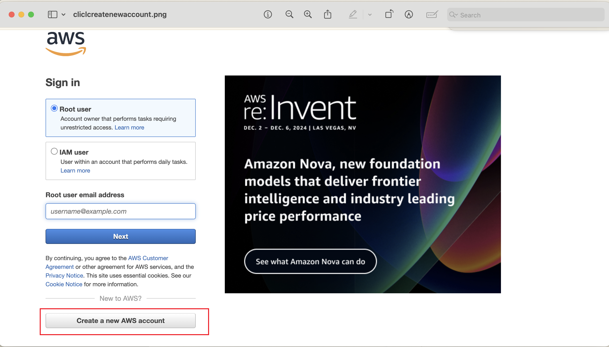
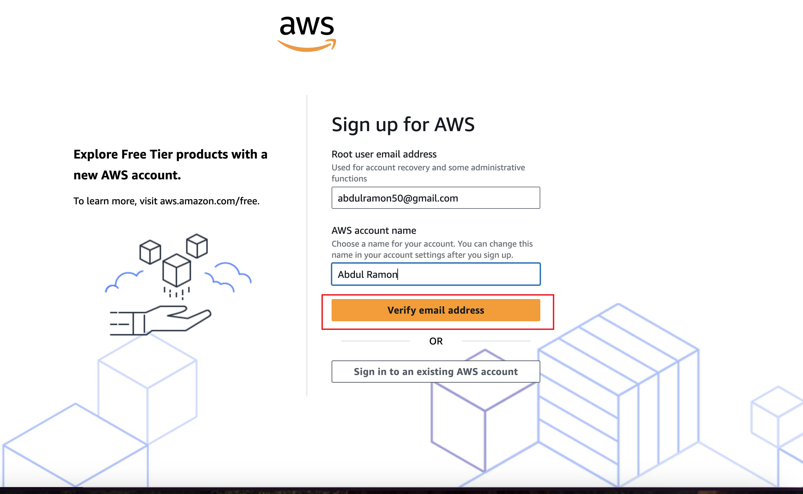
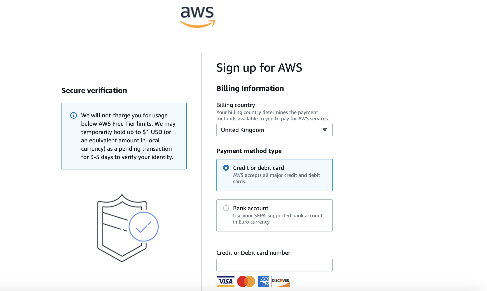
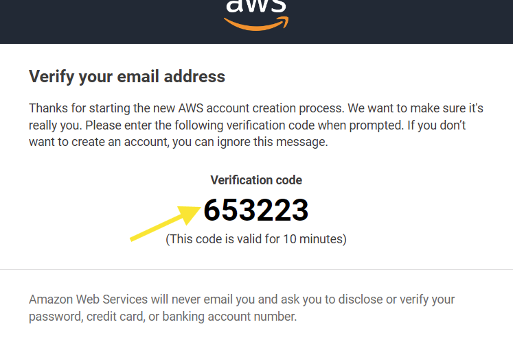
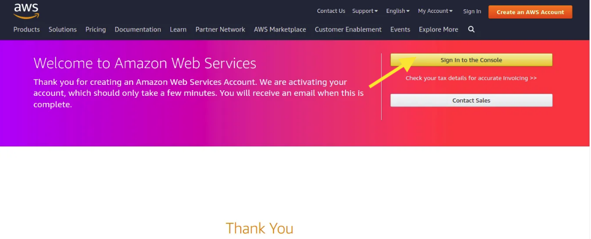
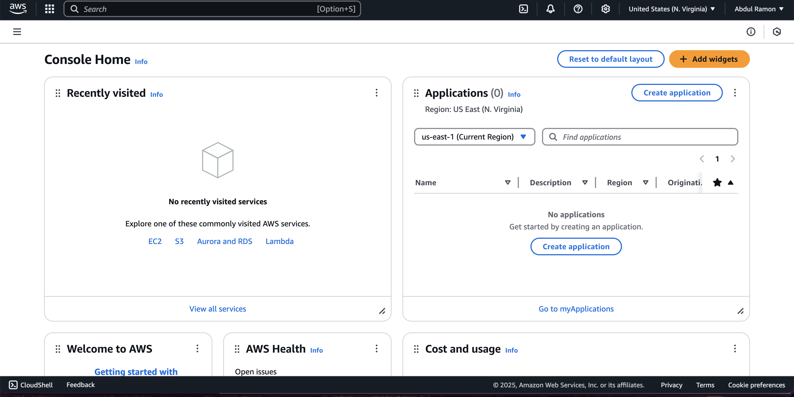

## Mini Project - AWS Account Creation Project

### 1. Project Overview

#### 1.1 Project Goals

- Understand the basics of AWS Cloud and its importance for businesses and individuals.

- Successfully create an AWS account and navigate the setup process.

- Learn how to access the AWS Management Console using newly created account credentials.

#### 1.2 Requirements

The setup includes the following:

1. Creating an AWS account

2. Logging into the AWS Management Console

#### 1.3 Use Case

- Gain access to AWS services for cloud-based projects.

### 2. Creating an AWS Account
Steps to Create an AWS Account
- 1. Visit AWS Sign-up page:

 - Navigate to [AWS Official Website](https://aws.amazon.com/free/?gclid=Cj0KCQiA8q--BhDiARIsAP9tKI07VHV1QXEVIrPyqJY2KaS2vutYznUXSdOmaKX-iKbFqQ6SYu9ML0YaAvZhEALw_wcB&trk=ce1f55b8-6da8-4aa2-af36-3f11e9a449ae&sc_channel=ps&ef_id=Cj0KCQiA8q--BhDiARIsAP9tKI07VHV1QXEVIrPyqJY2KaS2vutYznUXSdOmaKX-iKbFqQ6SYu9ML0YaAvZhEALw_wcB:G:s&s_kwcid=AL!4422!3!433803621002!e!!g!!aws%20sign%20up!9762827897!98496538743&all-free-tier.sort-by=item.additionalFields.SortRank&all-free-tier.sort-order=asc&awsf.Free%20Tier%20Types=*all&awsf.Free%20Tier%20Categories=*all).

 - Click Create an AWS Account.

1. Enter Account Details:

Provide an email address, set up a password, and create an account name.

3. Choose Account Type:

Select Personal or Business based on usage needs.

4. Enter Contact Information:

Fill in personal or business details as required.

5. Provide Payment Information:

AWS requires a valid credit/debit card for verification, but Free Tier services will not be charged unless limits are exceeded.

6. Verify Identity:

Enter the verification code sent to your phone/email.

7. Choose a Support Plan:

Select Basic (Free) unless additional support is needed.

8. Sign in to AWS Console:

Once the account is activated, log in using the provided credentials.

#### Troubleshooting

Payment verification failed? Ensure your card supports international transactions.

#### 3. Navigating the AWS Management Console

Steps to Access AWS Console

1. Log in to AWS:

Visit AWS Console and sign in.

2. Understand AWS Free Tier:

Check Free Tier usage limits to avoid unexpected charges.

#### Troubleshooting

Login issues? Reset the password if needed.

